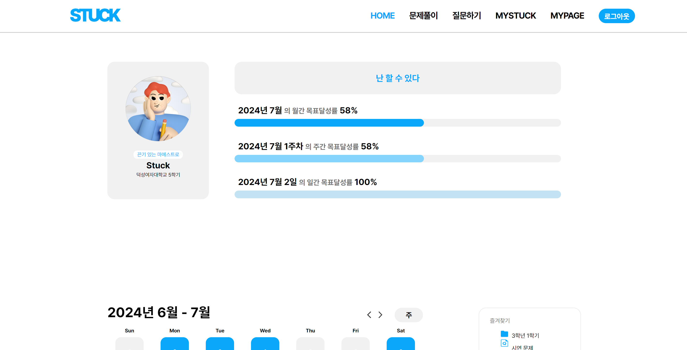
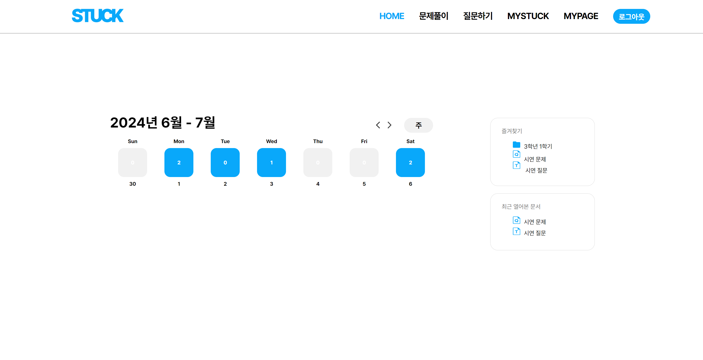
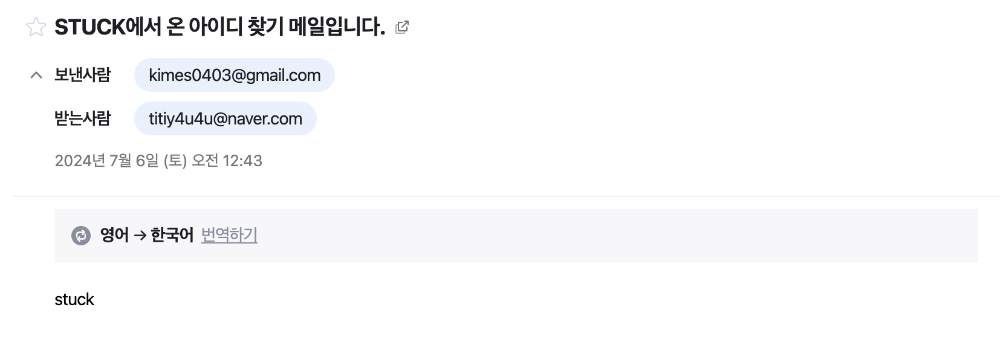

# 2024-Herethon-2
2024 여기톤 : HERETHON 2조 <br><br>


👉🏻 [서비스 바로가기](http://15.164.255.252/)
- id : Stuck
- password : Stuck1234!!


<br><br>
### 📙 프로젝트 소개
STUCK은 자기주도학습을 위한 AI 문제생성 및 질의응답 서비스입니다.
학생들의 자기주도적 학습 태도 정립을 목표로 만들어진 STUCK은 다음과 같이 소비자들의 painpoint를 해결합니다.
#### 1. 문제풀기
* 문제 생성 탭으로 이동하여 저장하고자 하는 폴더를 생성하거나, 선택한 후 문제를 생성할 수 있습니다.
* 문제의 이름, 생성할 문제의 개수, 문제의 유형(객관식, 주관식), 생성하고자 하는 교재의 pdf나 이미지를 업로드할 수 있습니다.<br>
  <br>
  
  
  

* 이미지를 업로드한 후 문제 생성 버튼을 클릭했다면 업로드한 이미지의 텍스트를 google cloud vision API를 통해 추출합니다.
* 추출한 텍스트를 기반으로 프롬프팅을 통해 chatGPT에게 문제 생성을 요청합니다.
* chatGPT의 응답을 기반으로 문제를 생성합니다.
* 문제를 풀었다면 채점 기능을 이용할 수 있습니다.
* 생성한 문제는 PDF와 WORD 형태로 저장할 수 있습니다.
  * 자주 보는 문제는 즐겨찾기를 눌러 나중에 MySTUCK 페이지에서 확인할 수 있습니다.
  <br><br>
  
  
  

#### 2. 질문하기
* 질문하기 탭으로 이동하여 문제풀기와 마찬가지로 폴더를 지정합니다.
* 질문할 파일을 등록하고 질문 이름을 지정합니다.
* 질문하기를 생성했다면 왼쪽에는 chatGPT를 이용한 질의응답, 오른쪽은 공부하면서 메모를 저장합니다.
* 질의응답 채팅 내용, 메모 모두 PDF와 WORD로 저장할 수 있습니다.
* 틀린 문제만 보기, 다시 풀기 옵션을 제공합니다.
* 자주 보는 질문하기는 즐겨찾기를 눌러 나중에 MySTUCK 페이지에서 확인할 수 있습니다. <br><br>
  
  


#### 3. My Stuck
* 이전까지 생성했던 폴더 및 파일을 확인할 수 있는 공간입니다.
* 컴퓨터 시스템의 파일탐색기와 매우 유사하며, 드래그하여 삭제, 드래그하여 폴더 및 파일 이동 기능을 모두 지원합니다.
* 폴더 및 파일 찾기도 가능합니다.
* 즐겨찾기한 항목은 아래에 회색으로 나타납니다.<br><br>
  


#### 4. MyPage
* 목표 설정을 할 수 있습니다.
* 캘린더와 연동했으며 할 일을 완수한 날이 있다면 파란색 배경, 할 일을 완수하지 못했다면 회색 배경으로 나타납니다.
* 루틴, 할 일은 추가 및 삭제가 가능합니다.
* 목표설정 아래를 스크롤하면 내 정보를 수정할 수 있습니다. <br><br>
  
  

#### 5. Home
* 월간 달성률, 주간 달성률, 일간 달성률을 확인할 수 있습니다.
* 즐겨찾기한 항목, 최근 열어본 문서를 확인할 수 있습니다. <br><br>
  
  

#### 6. 아이디, 비밀번호 찾기
* 아이디를 잃어버렸을 경우 이메일 입력을 통해 가입했을 때의 아이디를 찾을 수 있습니다.
* 비밀번호를 잃어버렸을 경우 이메알, ID 입력을 통해 비밀번호를 재설정할 수 있습니다. <br><br>
  
  
  


<br><br>
### 개발기간
2024.06.25 ~ 2024.07.06

<br><br>
### 🦁 STUCK 개발 팀원 소개
#### Plan & Design
| <center> 박우현  </center>                                                                                                                    |
|--------------------------------------------------------------------------------------------------------------------------------------------|
| <center> </center> | 
| <center> 기획, 디자인 </center>                                                                                                                 |
####  ️Front-end

| <center> 최수진 </center>                                                                          | <center> 송유선 </center>                                                                         | 
|---------------------------------------------------------------------------------------------------|---------------------------------------------------------------------------------------------------|
| <center> </center> | <center> </center> | 
| <center> 역할1 </center>                                                                            | <center> 역할2 </center>                                                                           | 
| <center>  [@jinsujini](https://github.com/jinsujini) </center>                                    | <center> [@s-uxun](https://github.com/s-uxun) </center>                                           | 

#### Back-end
| <center> 김가현 </center>                                                                         | <center> 김은서 </center>                                                                            | 
|---------------------------------------------------------------------------------------------------|------------------------------------------------------------------------------------------------------|
| <center> </center> | <center>  </center> | 
| <center> 로그인 회원가입<br>아이디 비밀번호 찾기<br>목표 설정</center>                               | <center> 문제 & 질문 관련 기능<br>MyStuck 폴더 구조</center>                                           | 
| <center>  [@Kimgah](https://github.com/Kimgah) </center>                                          | <center> [@7beunseo](https://github.com/7beunseo) </center>                                           | 

<br><br>
### 🔥 기술 스택

####  ️Front-end
   

#### Back-end
 

#### ETC
  

<br><br>
### 📁 폴더 구조
```plain text
📂 2024-Herethon-2
└─ StuckProject
 ├─ accounts/
 │  ├─ __init__.py
 │  ├─ admin.py
 │  ├─ apps.py
 │  ├─ models.py
 │  ├─ tests.py
 │  └─ views.py
 ├─ media/
 ├─ qna/
 │  ├─ __init__.py
 │  ├─ admin.py
 │  ├─ apps.py
 │  ├─ models.py
 │  ├─ tests.py
 │  └─ views.py
 ├─ quiz/
 │  ├─ __init__.py
 │  ├─ admin.py
 │  ├─ apps.py
 │  ├─ models.py
 │  ├─ tests.py
 │  └─ views.py
 ├─ static
 │  ├─ css/
 │  ├─ fonts/
 │  ├─ img/
 │  └─ js/
 ├─ StuckProject
 │  ├─ __init__.py
 │  ├─ asgi.py
 │  ├─ settings.py
 │  ├─ urls.py
 │  └─ wsgi.py
 ├─ templates
 │  ├─ base.html
 ├─ todo/
 │  ├─ __init__.py
 │  ├─ admin.py
 │  ├─ apps.py
 │  ├─ models.py
 │  ├─ tests.py
 │  └─ views.py
 ├─ .env
 ├─ db.sqlite3
 ├─ manage.py
 ├─ requirements.txt
 ├─ service_account.json
 └─ manage.py
```

<br><br>
### 🖥️ 개발환경에서의 실행 방법
```shell
cd 2024-Herethon-2
python -m venv venv
source venv/Scripts/activate
cd StuckProject
pip install -r requirements.txt
python manage.py makemigrations
python manage.py migrate --run-syncdb
python manage.py runserer
```
* google cloud vision에서 api 발급 후 service_account.json 파일 다운로드
* openAI API 토큰 발급하여 .env 파일에 저장
```.env
OPENAI_API_KEY="발급받은 토큰"
```
